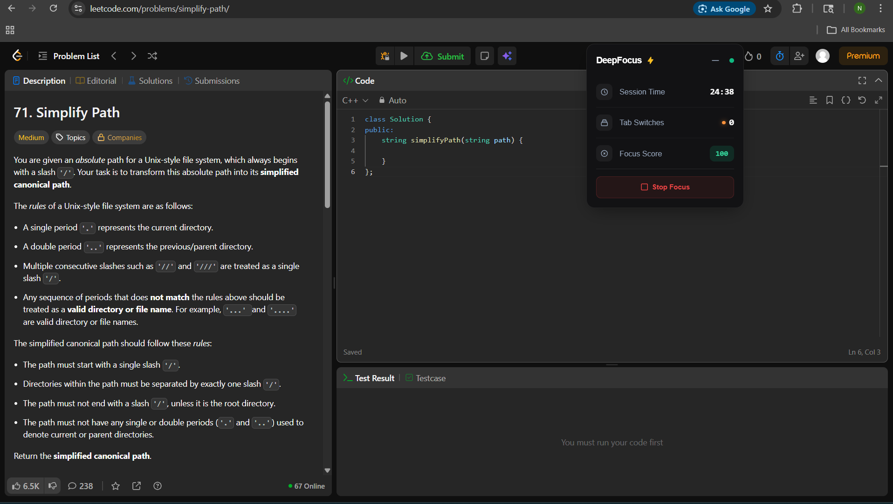
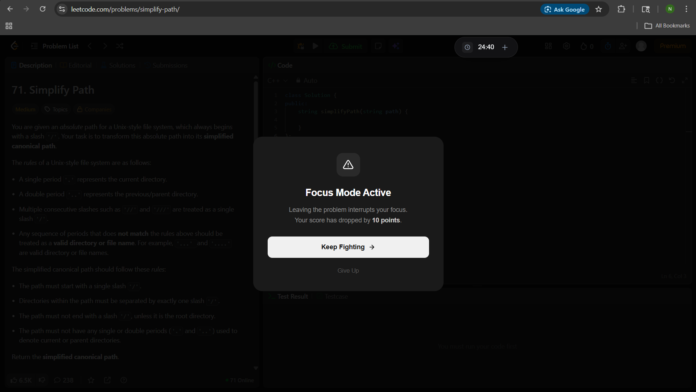
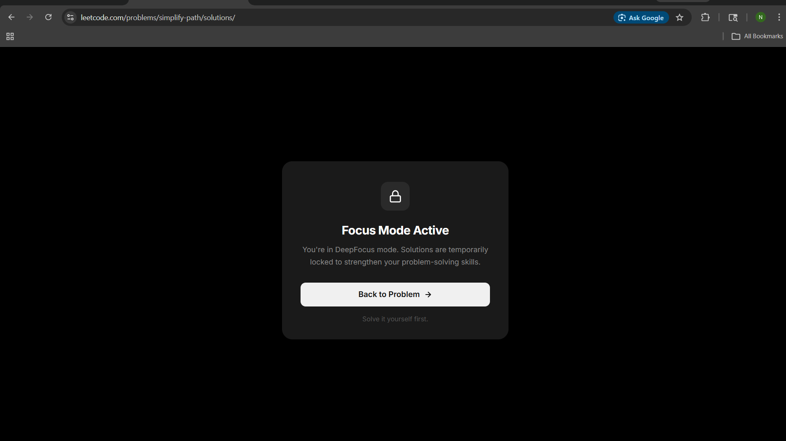
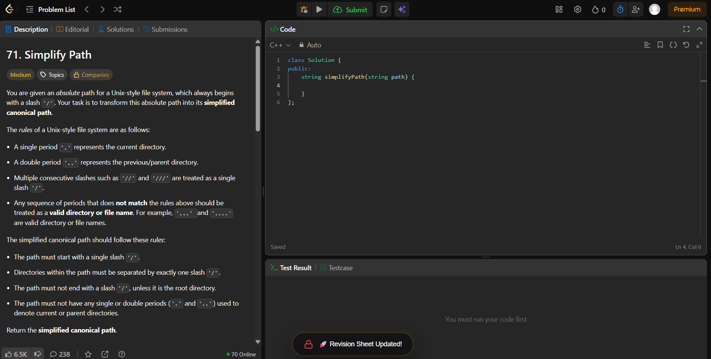
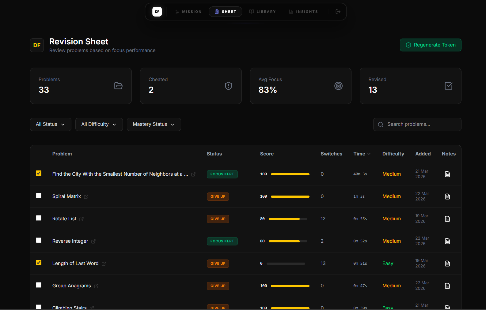

# DeepFocus 🚀

[](https://github.com/Saicharan-775/DeepFocus)
[](https://supabase.com)
[](https://chrome.google.com/webstore)

**DeepFocus** is a high-performance Browser Extension + Dashboard suite designed to turn LeetCode into a distraction-free training ground. It enforces discipline by tracking focus scores, penalizing tab switches, and blocking access to solutions during active sessions.

---

## 📸 Features in Action

### 1. Smart Focus Widget
The extension injects a real-time tracking widget into the LeetCode IDE. It monitors your **Session Time**, **Tab Switches**, and calculates a dynamic **Focus Score** based on your behavior.


### 2. Anti-Distraction Guard
Stay in the zone! If you attempt to leave the problem or switch tabs, DeepFocus triggers an immediate warning and penalizes your focus score.


### 3. Solution & Editorial Locking
No more "peeking" at the answer. DeepFocus hard-blocks the Solutions and Editorial tabs during your session, forcing you to think critically and build true problem-solving muscle.


### 4. Real-Time Sync
Once you submit or finish, all session data is instantly synced to your database. You'll receive a confirmation toast letting you know your revision sheet has been updated.


### 5. High-Performance Dashboard
Track your consistency, manage your revision problems, and analyze your focus trends through a centralized React dashboard powered by Supabase.


---

## ✨ Key Features

- **🎯 Difficulty-Aware Timers**: Auto-detects LeetCode difficulty (Easy: 10m, Medium: 25m, Hard: 40m).
- **📉 Discipline Scoring**: Real-time Focus Score drops for every distraction.
- **🚫 Solution Hard-Blocking**: Editorial/Solutions tabs are completely disabled during sessions.
- **🛡️ Copy/Paste Guard**: Prevents external code pasting to ensure you're actually writing the logic.
- **🔄 Spaced Repetition**: Failed or low-score sessions are automatically added to your "Revision Sheet."
- **📊 Interactive Dashboard**: Full React/Vite dashboard to track your consistency and progress over months.

---

## 🛠 Tech Stack

- **Extension**: Chrome Extension MV3, Vanilla JavaScript, CSS Modules.
- **Dashboard**: React 18, Vite, TailwindCSS, Framer Motion.
- **Backend**: Supabase (PostgreSQL, Edge Functions, Row-Level Security).
- **Security**: Token-based authentication, Hashed session validation, Hardened RLS.

---

## 🚀 Installation & Setup

### 1. The Dashboard
```bash
cd deepfocus-site
npm install
cp .env.example .env  # Add your Supabase project keys
npm run dev
```

### 2. The Extension
1. Open `chrome://extensions/`
2. Enable **Developer mode**.
3. Click **Load unpacked** and select the `deepfocus-extension` folder.
4. Open your dashboard and copy your **Unique Connection Token** into the extension popup.

---

## 🔒 Security First

DeepFocus is built with production security standards:
- **Zero Exposed Secrets**: Only public `ANON_KEY` is used on the client; all sensitive writes are handled by `SECURITY DEFINER` functions or Edge Functions.
- **Hardened RLS**: Every single table is protected by Row-Level Security (RLS), ensuring that your focus data is yours and yours alone.
- **Data Integrity**: Database-level constraints ensure that focus scores and session metrics remain valid even if API requests are tampered with.

---

## 📄 License

MIT © 2024 Saicharan-775

---

**Built to help Coders build real problem solving skill, not just green squares on Leetcode.**
